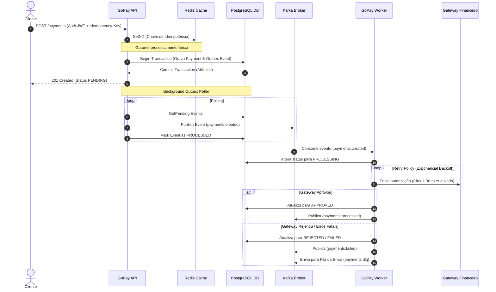

# GoPay Processing Engine 🚀

[](https://golang.org)
[](https://www.postgresql.org)
[](https://redis.io)
[](https://kafka.apache.org)
[](https://opentelemetry.io)
[](https://prometheus.io)

O **GoPay Processing Engine** é um motor de processamento de pagamentos assíncrono de alta performance, projetado sob os princípios de **Clean Architecture** e padrões de resiliência. O sistema implementa consistência eventual via **Transactional Outbox**, proteção de duplicidade com controle de **Idempotência**, tolerância a falhas com **Circuit Breaker** e observabilidade completa (Traces e Métricas).

---

## 🏗️ Arquitetura do Sistema

A aplicação está estruturada em duas partes principais:
1. **API Service (`cmd/api`)**: Recebe requisições HTTP REST, realiza autenticação JWT, valida dados e salva a transação no banco junto com o evento do Outbox no mesmo limite transacional.
2. **Worker Service (`cmd/worker`)**: Consome mensagens do Apache Kafka, processa as transações financeiras integrando com o Gateway de Pagamentos externo (simulado) com políticas de retentativas e DLQ.



---

## 📁 Estrutura de Diretórios

A divisão do código respeita os conceitos de desacoplamento e isolamento de domínio:

```
├── .github/workflows/   # Pipeline CI/CD (GitHub Actions)
├── cmd/
│   ├── api/             # Entrypoint executável do Servidor REST HTTP
│   └── worker/          # Entrypoint executável do Consumidor Worker
├── docker/
│   └── prometheus/      # Arquivos de configuração do Prometheus scraper
├── docs/                # Arquivos Swagger auto-gerados
├── internal/
│   ├── application/     # Casos de uso do sistema (PaymentService, Worker, Outbox)
│   ├── config/          # Carregamento de configurações de ambiente
│   ├── domain/          # Entidades de negócio puro e contratos de interfaces
│   ├── infrastructure/  # Implementações de adaptadores (Postgres, Redis, Kafka, Gateway)
│   ├── interfaces/      # HTTP REST controllers e middlewares
│   └── middleware/      # Middlewares Gin de autenticação JWT e CORS
├── migrations/          # Scripts SQL do golang-migrate (PostgreSQL DDL)
├── pkg/
│   ├── logger/          # Logging estruturado de alta performance com Uber Zap
│   ├── security/        # Criptografia Bcrypt e assinatura JWT
│   └── telemetry/       # Inicializadores OTel Tracer (Jaeger) e Prometheus
├── scripts/             # Scripts utilitários de build / testes
├── docker-compose.yml   # Orquestração do ambiente completo
├── Dockerfile           # Build Docker otimizado multi-stage
└── Makefile             # Atalhos utilitários para desenvolvedores
```

---

## ⚡ Começando

### Pré-requisitos
Certifique-se de ter instalado em sua máquina:
* [Docker](https://www.docker.com/products/docker-desktop/) e [Docker Compose](https://docs.docker.com/compose/)
* [Go 1.26](https://go.dev/dl/) (caso queira rodar ou compilar localmente)

---

### Executando com Docker Compose 🐳

1. **Configurar Variáveis de Ambiente**:
   Copie o arquivo `.env.example` para `.env`:
   ```bash
   cp .env.example .env
   ```
   *Nota: O arquivo `.env` está no `.gitignore` para proteger suas credenciais.*

2. **Subir a Infraestrutura e Serviços**:
   Execute o comando abaixo para iniciar todos os contêineres em background (PostgreSQL, Redis, Kafka, Zookeeper, Jaeger, Prometheus, API e Worker):
   ```bash
   docker compose up --build -d
   ```

3. **Verificar os Logs**:
   ```bash
   docker compose logs -f api
   docker compose logs -f worker
   ```

4. **Desligar o Ambiente**:
   ```bash
   docker compose down
   ```

---

### Desenvolvimento Local (Makefile) 🛠️

Se você tiver o utilitário `make` instalado, poderá usar os seguintes atalhos:
* `make build`: Compila os binários da API e do Worker.
* `make run-api`: Inicia a API HTTP localmente.
* `make run-worker`: Inicia o Worker Kafka localmente.
* `make swagger`: Gera a documentação da API Swagger atualizada.
* `make test`: Executa todos os testes de unidade.
* `make test-coverage`: Executa a suíte de testes com cobertura de código (exige cobertura mínima de **80%**).
* `make clean`: Limpa arquivos de compilação temporários.

*Caso não possua o `make`, os comandos Go equivalentes (ex: `go test ./...`) podem ser executados diretamente no terminal.*

---

## 🔌 API Endpoints e Documentação

### Documentação Swagger UI
A API disponibiliza uma interface Swagger interativa para você testar todas as rotas diretamente pelo navegador.
Com os contêineres rodando, acesse:
👉 **[http://localhost:8080/swagger/index.html](http://localhost:8080/swagger/index.html)**

### Endpoints Principais
1. **Registrar Usuário** (`POST /auth/register`):
   Cria um novo usuário administrativo para autenticação.
2. **Autenticar Login** (`POST /auth/login`):
   Fornece o Bearer JWT Token necessário para acessar as rotas de pagamentos.
3. **Criar Pagamento** (`POST /payments`):
   Requer os headers `Authorization: Bearer <TOKEN>` e `Idempotency-Key: <UNIQUE_KEY>`.
4. **Consultar Pagamento** (`GET /payments/{id}`):
   Retorna o status atualizado da transação financeira.
5. **Listar Pagamentos** (`GET /payments`):
   Lista todas as transações cadastradas em ordem decrescente de criação.

---

## 📊 Observabilidade e Telemetria

Toda a aplicação é instrumentada com telemetria nativa:

* **Jaeger (Distributed Tracing)** 🔎:
  Todas as requisições geram *spans* distribuídos do OTel, conectando a recepção HTTP na API, o envio no outbox e o processamento no Worker.
  * Acesse o Dashboard em: **[http://localhost:16686](http://localhost:16686)**

* **Prometheus (Metrics Server)** 📊:
  Métricas como duração e volumetria de requisições HTTP, eventos processados e filas no Kafka estão disponíveis para scraping.
  * Acesse o Prometheus em: **[http://localhost:9090](http://localhost:9090)**
  * Endpoint de Métricas da API: `http://localhost:2112/metrics`
  * Endpoint de Métricas do Worker: `http://localhost:2113/metrics`

---

## 🧪 Suíte de Testes & CI/CD

### Executando Testes
Para rodar os testes unitários e de integração locais:
```bash
go test -v ./...
```

### Verificação de Cobertura de Código
Para compilar a cobertura e verificar se os códigos de lógica atendem ao limiar mínimo de **80%**:
```bash
go test -coverprofile coverage.out ./internal/domain ./internal/application ./internal/interfaces/http ./pkg/security ./internal/infrastructure/postgres ./internal/infrastructure/redis
go run scripts/check_coverage.go coverage.out 80
```

### CI/CD
Toda alteração enviada ao repositório via push ou Pull Request dispara a pipeline automática do **GitHub Actions** (`.github/workflows/ci.yml`) que compila a aplicação, executa todos os testes e barra builds se a cobertura cair abaixo dos **80%**.
