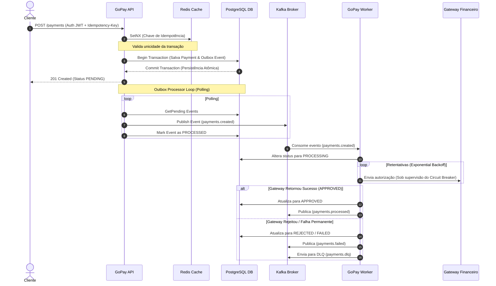

# GoPay Processing Engine 🚀

O **GoPay Processing Engine** é um motor de processamento de pagamentos distribuído de alto desempenho, desenvolvido com foco em resiliência, consistência eventual e isolamento de domínio (**Clean Architecture**). 

Este ecossistema foi projetado para resolver os problemas clássicos de sistemas financeiros distribuídos, como cobranças duplicadas, perda de mensagens durante falhas de rede (*dual-write problem*), lentidão de provedores externos e falta de rastreabilidade de requisições.

---

## ⚡ Diferenciais de Arquitetura e Engenharia

### 1. Garantia de Execução Única (Idempotência Distribuída)
Para mitigar cobranças duplicadas em conexões instáveis, a API exige um cabeçalho `Idempotency-Key` (UUID) em todas as transações de pagamento. A verificação é realizada de forma atômica no Redis utilizando a operação `SetNX`. Requisições repetidas retornam instantaneamente a resposta armazenada em cache, sem onerar o banco de dados principal ou reprocessar o fluxo financeiro.

### 2. Padrão Transactional Outbox (Consistência Eventual Segura)
A persistência do registro do pagamento e o agendamento de seu respectivo evento no Apache Kafka são unificados em uma única transação no PostgreSQL. Isso elimina o risco de o pagamento ser salvo no banco e a mensagem no broker falhar (ou vice-versa). Um poller em background lê continuamente a tabela de `outbox_events` e publica as mensagens no Kafka de maneira confiável (*at-least-once delivery*).

### 3. Autotolerância a Falhas e Resiliência (Circuit Breaker & Backoff)
O Worker de processamento assíncrono integra-se com o gateway financeiro parceiro através de uma política de retentativas automáticas baseadas em **Backoff Exponencial**. Para proteger a infraestrutura e evitar o desgaste de recursos quando o gateway externo está instável, as requisições passam por um **Circuit Breaker** (implementado com `sony/gobreaker`), que abre o circuito caso a taxa de erro ultrapasse os limites aceitáveis.

### 4. Fila de Erros Isolada (Dead Letter Queue - DLQ)
Mensagens corrompidas ou falhas permanentes que excedem o limite de retentativas são desviadas para um tópico exclusivo de **DLQ** (`payments.dlq`), evitando o travamento da fila de consumo principal (*head-of-line blocking*) e permitindo auditorias posteriores.

---

## 🖥️ Topologia da Solução

O fluxo de processamento e a interação entre os componentes do sistema são organizados da seguinte forma:



---

## 📁 Estrutura de Diretórios (Clean Architecture)

A organização das pastas respeita estritamente o desacoplamento de camadas, garantindo que as regras de negócio de domínio permaneçam independentes de tecnologias de infraestrutura (banco de dados, frameworks HTTP ou brokers):

```
├── .github/workflows/   # Workflow de Integração Contínua (CI)
├── cmd/
│   ├── api/             # Ponto de entrada (Main) do Servidor REST HTTP
│   └── worker/          # Ponto de entrada (Main) do Consumidor Kafka Worker
├── docker/
│   └── prometheus/      # Definições de scraping do coletor Prometheus
├── docs/                # Arquivos Swagger auto-gerados para documentação de API
├── internal/
│   ├── domain/          # Entidades de negócio puro e interfaces abstratas
│   ├── application/     # Casos de uso (serviços de orquestração e workers)
│   ├── infrastructure/  # Adaptadores concretos (Postgres, Redis, Kafka, Gateway)
│   ├── interfaces/      # Controladores HTTP REST e mapeadores de rotas
│   └── middleware/      # Middlewares Gin (Autenticação JWT, CORS)
├── migrations/          # Arquivos SQL DDL gerenciados pelo golang-migrate
├── pkg/
│   ├── logger/          # Logging estruturado de alta performance com Zap Logger
│   ├── security/        # Criptografia Bcrypt e assinaturas JWT
│   └── telemetry/       # Coletores e inicializadores do OTel e Prometheus
├── scripts/             # Scripts portáteis de utilidade interna (ex: Cobertura)
├── docker-compose.yml   # Orquestração local do ecossistema de infraestrutura
├── Dockerfile           # Definição multi-stage para compilações enxutas de produção
└── Makefile             # Centralizador de atalhos de automação de desenvolvimento
```

---

## 🚀 Como Iniciar

### Variáveis de Ambiente
Crie as configurações locais a partir do modelo de exemplo:
```bash
cp .env.example .env
```

### Inicialização via Docker Compose
Para compilar e inicializar todos os serviços de infraestrutura e aplicação de forma integrada:
```bash
docker-compose up --build -d
```
Este comando subirá a seguinte estrutura local:
* **`gopay-postgres`**: Banco relacional para armazenamento de dados e outbox.
* **`gopay-redis`**: Cache de leituras e gerenciamento atômico de idempotência.
* **`gopay-kafka` & `gopay-zookeeper`**: Distribuidor de eventos assíncronos.
* **`gopay-jaeger`**: Coletor e painel de distributed tracing.
* **`gopay-prometheus`**: Servidor de coleta de métricas em série temporal.
* **`gopay-api`**: Servidor REST HTTP ouvindo na porta `8080`.
* **`gopay-worker`**: Consumidor de processamento financeiro.

---

## 🛠️ Comandos de Desenvolvimento (Makefile)

O `Makefile` abstrai a complexidade operacional do projeto:

| Comando | Descrição |
| :--- | :--- |
| `make build` | Compila os binários de execução da API e do Worker localmente. |
| `make run-api` | Inicia o servidor HTTP da API em ambiente local de desenvolvimento. |
| `make run-worker` | Inicia o consumidor assíncrono do Worker em ambiente local. |
| `make swagger` | Atualiza a documentação estática do Swagger compilando comentários no Go. |
| `make test` | Roda toda a suíte de testes unitários e de integração. |
| `make test-coverage` | Executa os testes gerando relatório e validando o mínimo de **80% de cobertura**. |
| `make up` | Inicializa todos os contêineres Docker Compose em segundo plano. |
| `make down` | Desliga e limpa os contêineres e redes temporárias do Docker Compose. |
| `make clean` | Remove arquivos gerados de compilações anteriores (pasta `/bin`). |

---

## 🎛️ Painel de Endpoints locais

| Recurso | Endpoints | Descrição |
| :--- | :--- | :--- |
| **API Server** | `http://localhost:8080` | Porta padrão de escuta para requisições HTTP REST. |
| **Swagger UI** | `http://localhost:8080/swagger/index.html` | Interface gráfica interativa para testes rápidos de chamadas. |
| **Jaeger UI** | `http://localhost:16686` | Dashboard para visualização de trace ID distribuídos do OpenTelemetry. |
| **Prometheus** | `http://localhost:9090` | Servidor de monitoramento das métricas operacionais coletadas. |
| **API Metrics** | `http://localhost:2112/metrics` | Endpoint puro de coleta de métricas do servidor da API. |
| **Worker Metrics** | `http://localhost:2114/metrics` | Endpoint puro de coleta de métricas do servidor do Worker. |

---

## 💡 Guia de Teste Manual no Swagger UI

Para testar o fluxo completo via Swagger UI:

1. **Registrar Usuário**:
   * Acesse a rota `POST /auth/register`.
   * Envie credenciais JSON (ex: `{"email": "admin@gopay.com", "password": "password123"}`).
2. **Obter Token**:
   * Acesse a rota `POST /auth/login` com as mesmas credenciais para receber o token.
3. **Autenticar no Swagger**:
   * Clique no botão **"Authorize"** (cadeado verde no topo direito).
   * Digite `Bearer ` acompanhado do token copiado (ex: `Bearer eyJhbGciOiJIUzI1...`).
4. **Criar Pagamento**:
   * Acesse a rota `POST /payments`.
   * Preencha o header `Idempotency-Key` com um valor exclusivo.
   * Envie o payload JSON de criação (ex: `{"customer_id": "76974d6c-2f96-4198-a621-e0c262ba94a5", "amount": 120.00, "currency": "USD"}`).
5. **Consulte o Status**:
   * Acesse a rota `GET /payments/{id}` usando o ID retornado para ver o status atualizado do processamento.
